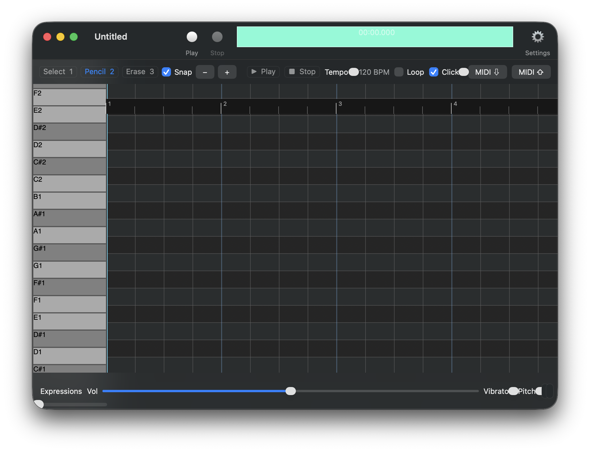

# SaltCase

Editor e sintetizador vocal para macOS, com piano roll, edição de expressões e compatibilidade inicial com o ecossistema UTAU/OpenUtau.

> Estado atual: protótipo funcional em modernização. O núcleo de edição, persistência, importação MIDI/USTX e reprodução estão operacionais; voicebanks e drivers de áudio devem ser validados na máquina do usuário.

[Repositório](https://github.com/dorayakito/saltcase-rt) · [Issues](https://github.com/dorayakito/saltcase-rt/issues) · [OpenUtau](https://github.com/stakira/OpenUtau)

SaltCase é a continuação do trabalho iniciado no SugarCape, originalmente desenvolvido para composição vocal japonesa. A interface atual está sendo reconstruída com foco em edição rápida, feedback visual claro e atalhos inspirados em editores modernos como o OpenUtau.



*Interface atual do editor: piano roll, régua de tempo, controles de transporte e painel de expressões.*

## Sumário

- [Recursos](#recursos)
- [Formatos](#formatos)
- [Primeiros passos](#primeiros-passos)
- [Atalhos](#atalhos)
- [Compilação](#compilação)
- [Arquitetura](#arquitetura)
- [Limitações conhecidas](#limitações-conhecidas)
- [Contribuição](#contribuição)
- [Licença](#licença)

## Recursos

### Piano roll

- Ferramentas Select, Pencil e Erase.
- Seleção múltipla com `Shift` e seleção retangular com `Option` + arrasto.
- Movimento, redimensionamento e transposição de notas.
- Snapping configurável, zoom e régua de tempo no topo.
- Playhead navegável por clique e arrasto na timeline.
- Undo/redo integrado ao documento.
- Copiar, recortar e colar preservando posição, duração, lyric, fonema, volume, vibrato e pitch bend.
- Feedback visual de seleção, hover, volume e pitch bend.

### Reprodução e síntese

- Reprodução em tempo real com Play/Stop.
- Tempo entre 40 e 320 BPM.
- Loop, metrônomo e controle de volume.
- Síntese vocal baseada nos recursos de áudio existentes do projeto.
- Exportação de áudio pelos formatos suportados pelo sistema.

### Expressões por nota

O painel inferior permite editar lyric, fonema personalizado, volume, vibrato e pitch bend. Os valores são persistidos no projeto e usados durante a geração dos eventos de áudio.

### Interface

- Toolbar moderna com efeito visual nativo do macOS.
- Painel de expressões responsivo.
- Janela com tamanho mínimo para evitar clipping dos controles.
- Indicadores visuais de ferramenta ativa e reprodução.
- Grade escura com linhas de pitch alternadas e batidas fortes destacadas.

## Formatos

| Formato | Abrir/importar | Exportar | Observação |
| --- | :---: | :---: | --- |
| Projeto SaltCase | Sim | Sim | JSON versionado, extensão `.scase` |
| Standard MIDI | Sim | Sim | `.mid` e `.midi`, notas e velocity |
| OpenUtau USTX | Sim | Não | `.ustx`, importação básica de BPM, posição, duração, tom e lyric |

Projetos SaltCase usam `formatVersion: 2`. Arquivos de versões futuras são recusados explicitamente para evitar perda silenciosa de dados.

## Primeiros passos

1. Abra o projeto no Xcode ou compile pela linha de comando.
2. Execute o app gerado em `build/Build/Products/Debug/SaltCase.app`.
3. Crie notas com a ferramenta Pencil ou abra um arquivo `.scase`, `.mid`, `.midi` ou `.ustx`.
4. Selecione uma nota para editar lyric, fonema e expressões no painel inferior.
5. Use a régua no topo do piano roll para navegar pela playhead.
6. Pressione `Space` para reproduzir.

## Atalhos

| Atalho | Ação |
| --- | --- |
| `Space` | Reproduzir/parar |
| `1`, `2`, `3` | Select, Pencil, Erase |
| `Shift` + clique | Adicionar à seleção |
| `Option` + arrasto | Seleção retangular |
| `Delete` / `Backspace` | Apagar notas selecionadas |
| `⌘ C`, `⌘ X`, `⌘ V` | Copiar, recortar, colar |
| `⌘ Z` / `⇧⌘ Z` | Desfazer/refazer |
| Setas | Transpor notas |
| `⌘` + ↑/↓ | Transpor uma oitava |
| `⌘` + ←/→ | Mover no tempo |
| `Option` + ←/→ | Alterar duração |
| `P` | Ativar/desativar snapping |
| `Q` / `E` | Zoom out/in |
| Clique/arrasto na régua | Navegar a playhead |

## Compilação

### Requisitos

- macOS 12 Monterey ou posterior;
- Xcode 27 ou posterior;
- arquitetura Apple Silicon ou Intel suportada pelo Xcode instalado.

### Build

```sh
xcodebuild \
  -project SaltCase.xcodeproj \
  -scheme SaltCase \
  -configuration Debug \
  -derivedDataPath build \
  build
```

O aplicativo será gerado em `build/Build/Products/Debug/SaltCase.app`.

```sh
open build/Build/Products/Debug/SaltCase.app
```

### Testes

```sh
xcodebuild \
  -project SaltCase.xcodeproj \
  -scheme SaltCase \
  -configuration Debug \
  -derivedDataPath build \
  test
```

A suíte cobre persistência, limites de expressão, eventos de áudio, pitch bend, versionamento de projetos e importação USTX.

## Arquitetura

```text
SCDocument
├── Persistência JSON versionada
├── Importação MIDI / USTX
├── SCNote
│   └── lyric, fonema, volume, vibrato, pitch bend
└── SCCompositionController
    ├── Toolbar e painel de expressões
    ├── SCPianoRoll
    │   ├── edição e seleção
    │   ├── snapping, zoom e timeline
    │   └── undo/redo e clipboard
    └── SCSynth / instrumentos vocais
```

O projeto é Objective-C/AppKit e usa Cocoa, AudioToolbox, QuartzCore e UniformTypeIdentifiers. O scheme compartilhado está em `SaltCase.xcodeproj/xcshareddata/xcschemes` para facilitar builds consistentes.

## Limitações conhecidas

- A importação USTX é deliberadamente básica e ainda não preserva trilhas múltiplas, voicebanks, fonemização avançada ou curvas completas de expressão.
- Voicebanks e amostras dependem dos recursos incluídos/configurados localmente.
- Alguns componentes da XIB original ainda podem emitir avisos de depreciação no macOS recente.
- A interface principal é voltada para macOS; não há suporte mobile nesta etapa.

## Contribuição

1. Crie uma branch para sua alteração.
2. Mantenha o projeto compilável.
3. Adicione ou atualize testes ao alterar modelos, importadores ou síntese.
4. Execute `xcodebuild ... test` antes de abrir um pull request.
5. Descreva alterações de formato, atalhos ou comportamento visual.

Issues e pull requests são bem-vindos, especialmente para melhorias de importação USTX/MIDI, voicebanks, acessibilidade e testes de interface.

## Licença

MIT License

Copyright © 2012 Sota Yokoe.

Permission is hereby granted, free of charge, to any person obtaining a copy
of this software and associated documentation files (the “Software”), to deal
in the Software without restriction, including without limitation the rights
to use, copy, modify, merge, publish, distribute, sublicense, and/or sell
copies of the Software, and to permit persons to whom the Software is
furnished to do so, subject to the following conditions:

The above copyright notice and this permission notice shall be included in all
copies or substantial portions of the Software.

THE SOFTWARE IS PROVIDED “AS IS”, WITHOUT WARRANTY OF ANY KIND, EXPRESS OR
IMPLIED, INCLUDING BUT NOT LIMITED TO THE WARRANTIES OF MERCHANTABILITY,
FITNESS FOR A PARTICULAR PURPOSE AND NONINFRINGEMENT. IN NO EVENT SHALL THE
AUTHORS OR COPYRIGHT HOLDERS BE LIABLE FOR ANY CLAIM, DAMAGES OR OTHER
LIABILITY, WHETHER IN AN ACTION OF CONTRACT, TORT OR OTHERWISE, ARISING FROM,
OUT OF OR IN CONNECTION WITH THE SOFTWARE OR THE USE OR OTHER DEALINGS IN THE
SOFTWARE.
